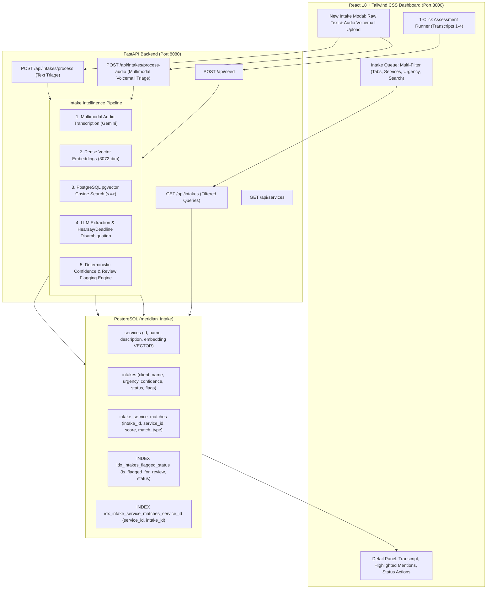

# Meridian Tax & Advisory — Client Intake & Triage System

An AI-powered client intake and triage system built for **Meridian Tax & Advisory** (a CPA and business advisory firm). It ingests raw client intake notes, voicemails, and audio recordings, executes **dense semantic vector retrieval using PostgreSQL `pgvector`** against the firm's 8 service catalog lines, extracts structured client data using **Google Gemini multimodal AI**, evaluates statutory tax deadline risks, and calculates a **mathematically transparent confidence score** with actionable review flags.

---

## 🏛️ System Architecture



---

## ✨ Core Features

1. **Semantic Vector Search with PostgreSQL `pgvector`**:
   - Stores 3072-dimensional vector embeddings for all 8 catalog services in PostgreSQL.
   - Incoming inquiries query the database using the SQL cosine distance operator (`<=>`), avoiding fragile keyword heuristics.

2. **Multimodal Audio Voicemail & Recording Support**:
   - Supports uploading client voicemails and audio files (`.mp3`, `.wav`, `.m4a`, `.ogg`, `.webm`, `.aac`).
   - Uses Gemini multimodal audio AI to transcribe speech verbatim before routing through the triage pipeline.
   - Built-in audio player preview in the modal.

3. **Nuance & Disambiguation Handling**:
   - **Hearsay vs. Actual Need**: Accurately distinguishes third-party hearsay (*"friend said audit package"*) from actual business pain (*"run finances / tell me if profitable"* $\rightarrow$ *Advisory & Fractional CFO*).
   - **Statutory Tax Deadline Awareness**: Detects estate tax timeline risks (*"dad passed last spring"* $\rightarrow$ flags IRS Form 706 9-month statutory delinquency risk as **HIGH** urgency).
   - **Missing Information Detection**: Explicitly identifies missing phone numbers, missing emails, and omitted business names when callbacks are requested.

4. **Mathematically Justified Confidence Scoring**:
   - Derived transparently from vector cosine similarity minus auditable penalty points for data defects, narrow margins, and intent shifts.
   - Interactive hover tooltips explain the exact breakdown behind lower confidence scores and high-urgency designations.

5. **Optimized PostgreSQL 3NF Schema & Indexes**:
   - Supports rapid querying of:
     - *"Everything flagged for review"*: `SELECT * FROM intakes WHERE is_flagged_for_review = TRUE` (indexed).
     - *"Everything matched to a given service"*: `JOIN intake_service_matches ON ... WHERE service_id = 'business_tax_prep'` (indexed).

6. **Clean, Modern React Dashboard**:
   - Filter by review status tabs (*All*, *Review Needed*, *Awaiting Confirmation*, *Approved*, *Rejected*).
   - Multi-dropdown filtering by **Service** and **Urgency** (`HIGH`, `MEDIUM`, `LOW`).
   - 1-Click Approval with strict validation gates, status toggles, service assignments, and deletion.

---

## 📊 4 Assessment Samples Verification

| Transcript | Scenario | Primary Matched Service | Urgency | Confidence | Status & Review Flags |
| :--- | :--- | :--- | :--- | :--- | :--- |
| **#1** | Karen Ibsen (Landscaping LLC, 2 employees, email/phone provided) | **Business Tax Preparation** (+ Payroll suggested) | `MEDIUM` | **87%** | `Awaiting Confirmation` (0 flags) |
| **#2** | Online store, asks for callback, missing name/phone/email | **Bookkeeping & Monthly Close** | `LOW` | **61%** | `Review Needed` (Missing contact info, missing client name) |
| **#3** | Mentions "audit" from friend hearsay, needs CFO/profitability, low budget | **Advisory & Fractional CFO** | `MEDIUM` | **36%** | `Review Needed` (Conflicting intent, budget mismatch, missing contact) |
| **#4** | Dad passed last spring, sitting on property for a year, estate tax concerns | **Retirement & Estate Planning** | `HIGH` | **60%** | `Review Needed` (Statutory IRS Form 706 9-month deadline alert) |

---

## 🚀 Step-by-Step Setup & Running Guide

### 1. Prerequisites
- **Python**: 3.10 or higher
- **Node.js**: 18.0 or higher
- **PostgreSQL**: Postgres.app, standard PostgreSQL, or SQLite fallback

---

### 2. Backend Setup

```bash
# 1. Navigate to project root
cd /Users/ankit/caAssignment

# 2. Create and activate a Python virtual environment
python3 -m venv .venv
source .venv/bin/activate

# 3. Install Python dependencies
pip install -r backend/requirements.txt

# 4. Configure environment variables (.env)
# Create or edit .env in project root:
```

```env
GEMINI_API_KEY=your_gemini_api_key_here
PORT=8080
HOST=0.0.0.0
CORS_ORIGINS=http://localhost:3000,http://localhost:5173,http://127.0.0.1:3000
DATABASE_URL=postgresql+psycopg2://localhost:5432/meridian_intake
# SQLite fallback if PostgreSQL is not used: sqlite:///./intake_database.db
```

```bash
# 5. Start the FastAPI backend server
uvicorn backend.main:app --host 0.0.0.0 --port 8080 --reload
```
* Backend API: `http://localhost:8080`
* Interactive API Documentation (Swagger): `http://localhost:8080/docs`

---

### 3. Frontend Setup

```bash
# 1. Open a new terminal and navigate to frontend directory
cd frontend

# 2. Install Node dependencies
npm install

# 3. Start the Vite React development server
npm run dev -- --port 3000
```
* Open your browser at **`http://localhost:3000`**.

---

### 4. Running the Test Suite

To run all unit and integration tests (including pipeline checks, audio validation, and prompt tests):

```bash
source .venv/bin/activate
pytest
```

---

### 5. Testing Audio Voicemail Upload

Two sample 10-second voicemail audio files are provided for testing:
* **`sample_voicemail.wav`**: Marcus Vance (Vance Design Studio LLC — Business Tax Prep & Bookkeeping).
* **`sample_estate_voicemail.wav`**: Arthur Pendelton (Deceased parent estate tax statutory deadline).

**To test**:
1. Click **"+ New Inquiry"** on the dashboard.
2. Select the **"Voicemail / Audio File"** tab.
3. Drag & drop `sample_voicemail.wav` into the upload box and preview playback.
4. Click **"Transcribe & Process Audio"**.

---

## 📖 Written Deliverables & Documentation

- **[Written Reflection](docs/written_reflection.md)**: Deep answers to the 5 evaluation questions (architecture trade-offs, hardest transcripts, production changes, assumptions, and next steps).
- **[Prompt Engineering Write-Up](docs/prompt_engineering.md)**: Breakdown of prompt structures, JSON schemas, few-shot grounding, and nuance handling.
- **[Retrieval Design & Confidence Formula](docs/retrieval_design.md)**: Vector embeddings, cosine similarity calculations, and mathematical score derivations.
- **[PostgreSQL Schema DDL](backend/schema.sql)**: Complete database schema with performance indexes.
